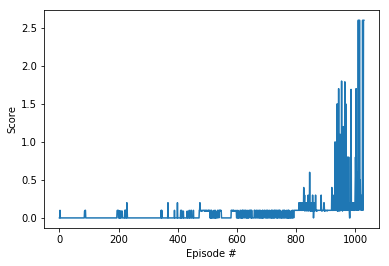

# Implementation
----------------------------------------------------------------------------------------------------------------------
## Learning Algorithm
The Multiple Agent Deep Deterministic Policy Gradient (MADDPG) Algorithm detailed in [this research paper](https://arxiv.org/pdf/1509.02971.pdf) is used after adjusting for using two agents. The algorithm can be outlined as follows:
- Randomly initialize critic networks and actors (for each agent).
- Initialize target networks (for each agent).
- Initialize replay buffer `R` (one memory for both agents).
- **for** episode = 1, M **do**:
    - Initialize a random process for action exploration (for both agents).
    - Receive initial observation states (for each agent).
    - **for** t = 1, T **do**:
        - Select action according to the current policy and exploration noise.
        - Execute action and observe reward and observe new state (for both agents).
        - Store transition `R` (for each agent).
        - Sample a random minibatch of `N` transitions from `R`.
        - Update critics (for each agent) by minimizing the loss.
        - Update the actor policy using the sampled policy gradient.
        - Update the target networks (for each agent).
        
    **end for** 
    
**end for**
  
## Hyperparameters
I started with the hyperparameters from the previous project, which were not very effective. Then I increased the buffer size and the discount factor, and decreased the batch size to accelerate the training. What really helped stabilize the training was: first, training on the whole episode at a time and removing the limit on time steps (which makes sense because it makes the agent learn more effectively about the entire episode, and it makes tracking progress even easier when the episodes get longer because both agents are actually learning to play well), and, second, increasing the standard diviation (sigma) of the OU Noise to explore the action space more fully and in less timesteps. 

### Agent Hyperparameters
`
BUFFER_SIZE = int(1e5) # replay buffer size
BATCH_SIZE = 128       # minibatch size
GAMMA = 0.99           # discount factor
TAU = 1e-3             # for soft update of target parameters
LR_ACTOR = 1e-4        # learning rate of the actor
LR_CRITIC = 1e-3       # learning rate of the critic
WEIGHT_DECAY = 0.0     # L2 weight decay
`

### Ornstein-Uhlenbeck Noise Hyperparameters
`
mu = 0.0
theta = 0.15
sigma=0.2
`

## Model Architecture
The Actor Network Class has only one fully-connected hidden layer, which I found to be more consistent than deeper architectures.

The Critic Network Class is deeper. It has three hidden fully-connected layers, each followed by a leaky-relu activation layer. I did not experiment much with it, since I found no need at that point. But it definitely would be a place for more exploration in the future. However, I found that using gradient clipping to update the network made a huge difference in the stability of the reward increase.

## Scores vs Episodes
### Reward Plot


### Total Number of Episodes
```
Episode 100	     Average Score: 0.005	Maximum Score: 0.100
Episode 200	     Average Score: 0.005	Maximum Score: 0.100
Episode 300	     Average Score: 0.012	Maximum Score: 0.200
Episode 400	     Average Score: 0.007	Maximum Score: 0.200
Episode 500	     Average Score: 0.035	Maximum Score: 0.200
Episode 600	     Average Score: 0.044	Maximum Score: 0.100
Episode 700	     Average Score: 0.046	Maximum Score: 0.100
Episode 800	     Average Score: 0.050	Maximum Score: 0.100
Episode 900	     Average Score: 0.131	Maximum Score: 0.600
Episode 1000	    Average Score: 0.289	Maximum Score: 1.800
Episode 1030	    Average Score: 0.513	Maximum Score: 2.600
 Environment solved in 930 episodes!	Average Score: 0.51
```

## Ideas for Future Work

Some more challenges to try would be to:
- Add batch normalization to stabilize the training even more.
- Experiment with the noise hyperparameters some more.
- Even though I got good results considering the time I spent exploring the hyperparameters phase-space, I think the MADDPG algorithm is very unstable when it comes to hyperparameters. It needs optimum values to converge consistently. So, I would try implementing other algorithms using the same environment, such as [PPO](https://arxiv.org/pdf/1707.06347.pdf), [A3C](https://arxiv.org/pdf/1602.01783.pdf), and [D4PG](https://openreview.net/pdf?id=SyZipzbCb).
